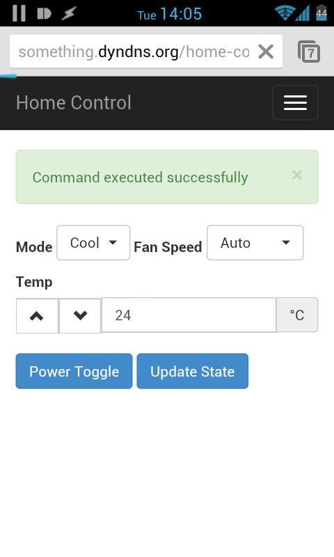

home-control
============

My simple home control and automation framework, based on [Arduino boards for real-world-interaction](https://github.com/itamaro/home-control-RPC),
and a [Django](https://www.djangoproject.com/) + [Bootstrap](http://getbootstrap.com/) web interface for online (mobile-friendly) access.

Also see [my blog post](http://itamaro.com/2013/10/04/ac-control-project-bringing-it-together/).

A sample of the A/C control web-app from a mobile device:


Generic Installation
--------------------
As this web-app is a simple Django project,
installation and deployment is as [any other Django project](https://docs.djangoproject.com/en/1.5/howto/deployment/)
(see some deployment configuration examples below).

Basically:

1. Clone the repository to the server machine that will serve the site.
2. Create a `local_settings.py` file in [`HomeControlWeb/HomeControlWeb`](HomeControlWeb/HomeControlWeb)
   to override settings from the [generic settings](HomeControlWeb/HomeControlWeb/settings.py) -
   specifically, set app-specific settings (more details follow).
3. [Deploy](https://docs.djangoproject.com/en/1.5/howto/static-files/deployment/) the [static files](https://github.com/itamaro/home-control-web/tree/master/static) to your web server of choice (global static files as well as app-specific static files!).
4. [Deploy](https://docs.djangoproject.com/en/1.5/howto/deployment/) the Django project to your web server of choice using your favorite method (I like [WSGI](https://docs.djangoproject.com/en/1.5/howto/deployment/wsgi/)).
5. Restart / Reload the web server.
6. Win.

### App-Specific Settings

* `HOME_CONTROL_SECRET_KEY` (default: (blank)):
    A secret key that protects access to the home control web-app (if not blank, the key must be specified when accessing the web-app using `http://url-of-server/home-control/AC/?key=<secret-key>`)
* `HOME_CONTROL_ACCMD_RPC_URL` (default: `http://localhost:8000/ac-command`):
    The RPC URL for A/C commands (see also the [RPC server project](https://github.com/itamaro/home-control-RPC))

TODO: Undocumented webcam module...


Apache+WSGI on Ubuntu Deployment Example
----------------------------------------

(tested with Ubuntu-Desktop-12.04.2-x64)

Requirements:

* Python and various dependencies: `sudo apt-get install libexpat1 python-pip build-essential python-imaging python-pythonmagick python-markdown python-textile python-docutils`
 * **WARNING:** Do not install python-django via apt-get on 12.04 - the default repositories hold an old version...
* Apache2, mod-WSGI: `sudo apt-get install apache2 apache2-mpm-prefork libapache2-mod-wsgi`
* Django: `sudo pip install Django`

Set up Apache groups and ownerships:

* Create "webmasters" group (`sudo groupadd webmasters`)
* Add self and Apache to the group:
 * `sudo usermod -a -G webmasters <username>`
 * `sudo usermod -a -G webmasters www-data`

Clone and configure the home-control web-app:

* Log in as self
* `cd ~`
* `git clone https://github.com/itamaro/home-control-web.git`
* `cd home-control-web/HomeControlWeb/HomeControlWeb`
* `<your-favorite-editor> local_settings.py`

Sample `local_settings.py` file (modify to fit your stuff):

```python
DEBUG = False
ALLOWED_HOSTS = ['localhost', 'ip-address', 'your.domain.com']
STATIC_ROOT = '/var/www/home-control-web/static'
STATICFILES_DIRS = ('/home/<username>/home-control-web/static', )
SECRET_KEY = 'generated-gibberish' # Note: API key, not Home control key!

# HomeControl app settings
HOME_CONTROL_SECRET_KEY = 'typable-pass-string'
HOME_CONTROL_ACCMD_RPC_URL = 'http://192.168.2.113:8001/ac-command'
```

Deploy Django static files to statically served directory:

* `cd ~/home-control-web/HomeControlWeb`
* `sudo python manage.py collectstatic`

Create a virtual host conf file for the Apache site:

* `cd /etc/apache2`
* `sudo <your-favorite-editor> sites-available/home-control`

```apache
<VirtualHost *:80>
     ServerAdmin <your@email>

     Alias /static/ /var/www/home-control-web/static/
     WSGIScriptAlias /home-control /home/username/home-control-web/HomeControlWeb/HomeControlWeb/wsgi.py
     WSGIDaemonProcess home-control python-path=/home/username/home-control-web/HomeControlWeb
     WSGIProcessGroup home-control

     <Directory />
          Options FollowSymLinks
          AllowOverride None
     </Directory>
     <Directory /var/www/>
          Options Indexes FollowSymLinks MultiViews
          AllowOverride None
          Order allow,deny
          allow from all
     </Directory>
     <Directory /home/username/home-control-web/HomeControlWeb/HomeControlWeb>
          <Files wsgi.py>
               Order deny,allow
               Allow from all
          </Files>
     </Directory>

     ErrorLog ${APACHE_LOG_DIR}/error.log
     LogLevel warn
     CustomLog ${APACHE_LOG_DIR}/access.log combined
</VirtualHost>
```

Disable the default site and enable to home control web-app:

* `sudo a2dissite 000-default`
* `sudo a2ensite home-control`

Reload the Apache server:

* `sudo service apache2 reload`


Nginx+Gunicorn on Ubuntu Deployment Example
-------------------------------------------

Soon


Local Development Setup
-----------------------

Soon
